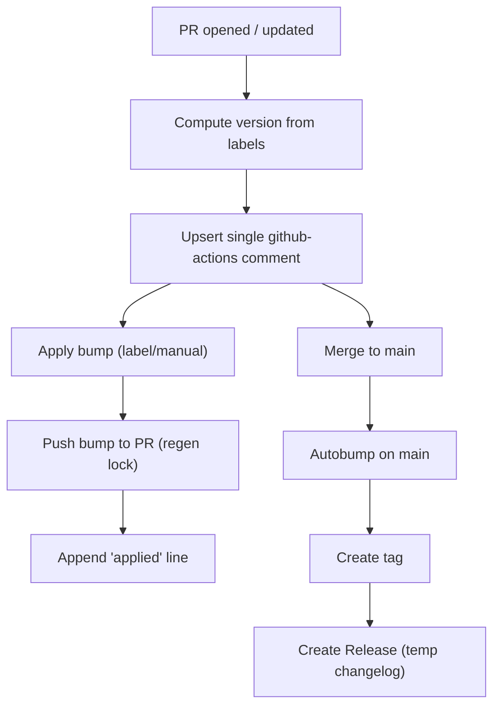

# Versioning flow — compact

Top-down visual summary of the versioning flow.



Notes

- Single bot comment: the workflow upserts one comment and consolidates duplicates.
- Apply: run on the PR branch to set package.json to the computed version, push to the PR, and regenerate package-lock.json; auto-apply is gated (label/manual) and idempotent — successful applies append an "applied" line.
- Autobump on main: run after merge to ensure main actually contains the bumped version (covers cases where the PR merged without the bump); creates tag and Release using a temporary changelog.

These snippets mirror the steps the GitHub Actions workflows run (for debugging or local reproduction only).

Snippets (copy/paste)

Apply bump (PR branch)

```bash
# compute & apply on PR branch (same-repo)
.github/scripts/bump-version.sh package.json auto --apply
npm install --package-lock-only
git add package.json package-lock.json
git commit -m "chore: bump to vX.Y.Z" || true
git push
```

Autobump (main)

```bash
# run on main (after merge)
git checkout main
.github/scripts/bump-version.sh package.json auto --apply
# if files changed
git add package.json package-lock.json
git commit -m "chore: ensure main bumped to vX.Y.Z" || true
git push
git tag -a vX.Y.Z -m "release vX.Y.Z"
git push origin vX.Y.Z
```
