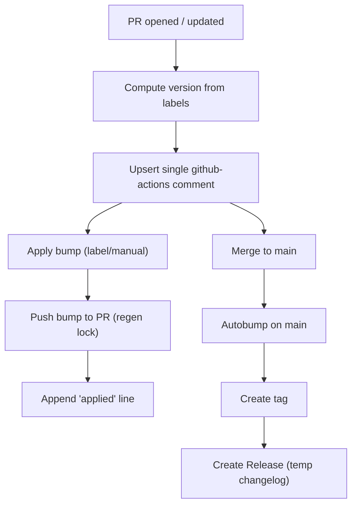

# Versioning flow — compact

Top-down visual summary of the versioning flow.



Notes

- Single bot comment: the workflow upserts one comment and consolidates duplicates.
- Apply: run on the PR branch to set package.json to the computed version, push to the PR, and regenerate package-lock.json; auto-apply is gated (label/manual) and idempotent — successful applies append an "applied" line.
- Autobump on main: run after merge to ensure main actually contains the bumped version (covers cases where the PR merged without the bump); creates tag and Release using a temporary changelog.

These snippets mirror the steps the GitHub Actions workflows run (for debugging or local reproduction only).

Snippets (copy/paste)

Release handling in this repository uses `auto shipit` as the single source
of truth for version bumps, tags, and GitHub Releases. We follow a "pure-auto"
policy: PR checks compute and display the candidate version, but do not mutate
the PR branch. The `release-with-auto.yml` workflow performs the atomic
bump+tag+publish operation via `auto shipit` on `main`.

Local / debugging snippets

Compute candidate for a PR (dry-run):

```bash
# run from the PR branch or an environment that mirrors the merged tree
npx auto shipit --dry-run 2>&1 | tee auto-shipit-dry-run.log
```

Create the release (run on `main`, use a token with push/release permissions):

```bash
# ensure you are on the commit you want to release
npx auto shipit
# after a successful run, reconcile lockfiles if required
npm ci
git add package-lock.json pnpm-lock.yaml yarn.lock || true
git commit -m "chore(release): update lockfile(s) after release [skip ci]" || true
git push
```
